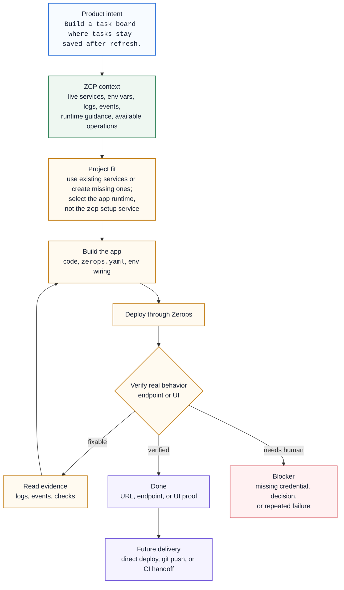

ZCP turns product or app intent into a verified deployed app by giving the coding agent two things it normally lacks: current knowledge of the Zerops project and the tools to change, deploy, inspect, and verify it.

## The model in one pass

Product intent enters a project loop: read current state, decide whether the needed services already exist, change the app and its Zerops wiring, deploy, verify from evidence, and return either proof or a concrete blocker.

The important signals are simple: the agent read current project state, named the target runtime, verified the requested behavior, and explained what remains.

## Where ZCP runs

ZCP can run in two places:

| Path | What runs where | What changes for you |
|---|---|---|
| Remote setup | A `zcp@1` service runs the `zcp` binary inside the Zerops project. **Include Coding Agent** adds the bundled agent CLI and preconfigures it to use ZCP; **Cloud IDE** adds browser VS Code. | The work stays inside the project. The agent can use project-private networking and SSHFS mounts for runtime files. |
| Local setup | The `zcp` binary runs on your laptop after `zcp init`, and your editor's agent talks to it. | Your checkout and dev server stay local. Managed services are reached over VPN, and `.env` generation bridges project credentials into your local app. |

The project-scoped control plane is the same idea in both paths. The filesystem, network path, deploy source, and safety profile are different. See [Choose remote or local setup](/zcp/setup/choose-workspace).

## What ZCP reads

ZCP reads live project state instead of relying on a long prompt:

- services and whether they are runtime or managed dependencies,
- runtime layout, such as one app runtime, a dev+stage pair, or a local checkout linked to a Zerops runtime,
- service env-var keys and references,
- build/deploy events, runtime logs, and verification results,
- the current work state when a session is interrupted.

Recovery starts from live state. If a session gets confused or interrupted, ask the agent to read ZCP status before changing anything else.

## What counts as done

A task is not done when code is written, or when a build succeeds. A ZCP task is done when the target runtime was deployed, platform reachability passed, the requested behavior was verified against the real endpoint or UI, and the agent reported the URL or a concrete blocker.

Workflow path: [Build with ZCP](/zcp/workflows/build-with-zcp). Exact terms and runtime layouts: [Workflow terms](/zcp/reference/agent-workflow).
