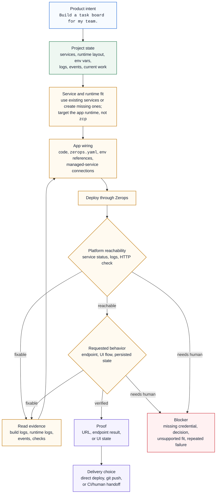

ZCP does not make you run a workflow by hand. It gives the coding agent a project loop: read the current Zerops project, fit the requested app change to the right services, wire the app, deploy it, verify real behavior, and either return proof or stop on a blocker that needs human judgment.

## The loop

The agent should make this path visible while it works, but you should not have to prompt each step. ZCP exists so the operational path is available behind a product request.

## The lifecycle layers

ZCP separates the work into three layers so the agent can tell what kind of step comes next.

**Service setup.** Prepare the project shape before app work starts: use existing services when they fit, create missing runtimes or managed dependencies when they do not, record the runtime layout, and establish the app target. This layer is not where app code, `zerops.yaml`, or the first deploy belongs.

**Development loop.** Change code and configuration, deploy the selected runtime services, verify platform reachability, verify the requested behavior, read logs and events on failure, fix from evidence, and repeat until proof or blocker.

**Delivery handoff.** After a verified running result exists, choose how future changes should ship: keep direct deploys, push to git, or hand off to CI or a human release process. The first functional deploy is direct; delivery setup follows proof.

## 1. Read the project before choosing a plan

The first useful move is discovery. ZCP reads live project state instead of relying on a long prompt or stale notes:

- runtime services and managed services,
- runtime layout, such as one app runtime, a dev+stage pair, or a local checkout linked to a Zerops runtime,
- env-var keys and references,
- build/deploy events, runtime logs, and recent verification results,
- current work state when a session resumes after an interruption.

This is why a prompt can stay short. The agent can inspect what exists instead of asking you to paste the project inventory.

## 2. Fit the request to services and runtimes

The agent then decides where the app work belongs. The `zcp` service is the control-plane setup, not the app target. App code deploys to runtime services such as `appdev`, `appstage`, or `app`; managed services such as databases, cache, storage, search, or queues provide dependencies.

If the right services already exist, the agent should use them. If a requested app needs missing infrastructure, the agent can create it before app work starts. If the choice affects product scope, cost, credentials, or destructive changes, the agent should stop and ask.

## 3. Wire the app to Zerops

App work usually spans code and platform wiring. The agent may need to update application files, `zerops.yaml`, service references, env vars, migrations, seeds, or framework configuration so the app runtime can reach its managed services after deploy.

ZCP guidance matters here because Zerops has its own build, deploy, networking, and env-reference rules. The agent should use those rules instead of importing assumptions from Docker Compose, Kubernetes, or a generic cloud template.

## 4. Deploy, read evidence, and retry from the cause

Deploy is part of the work, not a separate instruction. ZCP gives the agent access to the Zerops deploy path and the evidence needed when it fails: build output, runtime logs, project events, service status, and recovery hints.

A failed build, broken start command, missing env reference, or unreachable route should lead to evidence-driven fixes. Repeating the same deploy without a new cause is not progress; after repeated failure or a missing decision, the useful result is a blocker.

## 5. Verify behavior, not only reachability

A successful deploy proves only that the runtime built and started. Platform reachability checks prove the service is running and reachable. They do not prove the product request.

For a task-board app, the behavior check is not "the page returns 200". The useful proof is the user-facing workflow the prompt asked for: tasks can be created, edited, moved, persisted, or shared according to the requested scope. For an API task, proof might be a JSON response from the endpoint. For a worker task, proof might be a processed job and the resulting stored state.

## 6. Return proof or a concrete blocker

A finished ZCP-backed app task should leave one of two things:

- proof: the changed runtime, URL or endpoint, and the specific behavior that was verified,
- blocker: the evidence read, what was tried, and the credential, decision, unsupported fit, or repeated failure that prevents completion.

That final proof is the practical difference between "the agent wrote code" and "the app task is done".

## Remote and local setup

The same `zcp` binary can run in two places. The project loop stays the same; the work surface changes.

| Path | What runs where | Practical effect |
|---|---|---|
| Remote setup | A `zcp@1` service runs the `zcp` binary inside the Zerops project. **Include Coding Agent** adds the bundled agent CLI; **Cloud IDE** adds browser VS Code. | Work happens inside the project boundary. The agent can use project-private networking and runtime file mounts. |
| Local setup | The `zcp` binary runs on your laptop after `zcp init`, and your local editor or CLI agent talks to it. | App edits, dev server, deploy source, and git credentials stay local. Managed services are reached over Zerops VPN, and `.env` generation bridges project credentials into your local app. |

Choose the setup based on where you want the agent and filesystem to live: [Choose remote or local setup](/zcp/setup/choose-workspace).

## Where to go deeper

- [Build with ZCP](/zcp/workflows/build-with-zcp) - normal app work after setup.
- [Workflow terms](/zcp/reference/agent-workflow) - exact runtime layouts, delivery terms, and completion evidence.
- [Troubleshooting](/zcp/reference/troubleshooting) - practical recovery when a run gets stuck.
