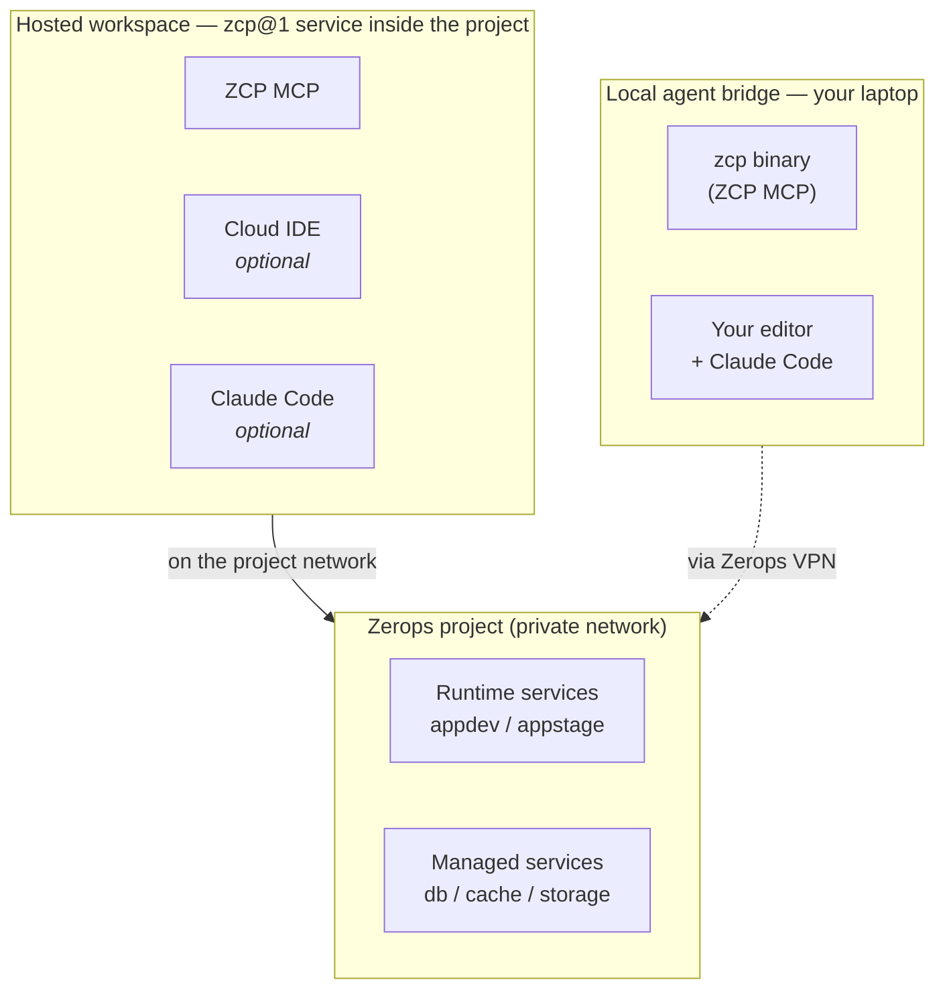

Zerops Control Plane (ZCP) is an MCP server — the `zcp` binary — that exposes a fixed set of project-scoped operations to a coding agent. It runs near the project, reads live platform state, and groups operations by user job. The agent never has to be told what the project looks like; the MCP reports it from what's deployed and running right now.

## Where ZCP runs

ZCP MCP runs near the project — either as part of a hosted `zcp@1` service inside the project (on the project's private network), or as a binary on your laptop talking to the Zerops API directly while your laptop has VPN access for any local-dev work that needs to reach project services by hostname.

- **Hosted workspace.** A Zerops service of type `zcp@1` runs the ZCP MCP inside the project, with optional bundled extras: a coding-agent CLI (Claude Code) and a browser-based VS Code (the Cloud IDE) with SSHFS access to runtime services and a curated dev toolchain. Created when you pick the **AI Agent** environment from a [Zerops recipe](https://app.zerops.io/recipes), or check **Add Zerops Control Plane (ZCP) service** during project creation.
- **Local agent bridge.** Run `zcp init` in your project directory and the `zcp` binary runs on your laptop. The agent runs in your editor and talks to the MCP; the MCP talks to the Zerops API on your behalf. Your laptop reaches project services over the Zerops VPN for anything outside the MCP (local dev server, manual `psql`, etc.). No editor, no SSHFS, no bundled agent.

The MCP operations are the same in both modes. What differs is what's bundled around the MCP: the hosted service adds editor, agent, SSHFS mounts, server-side batch deploys, and a dev-server runner; the local bridge adds deploys from your working directory and `.env` generation for local apps. Decision: [Choose your workspace](/zcp/setup/choose-workspace).

## Reads live platform state

When the agent needs context, the MCP queries the platform — what services exist, what state they're in, what ports and env variables they expose. Build and deploy timelines come from the events surface, which the agent reads when diagnosing a failure or polling a git-push deploy. No long prompt, no stale documentation; the answer comes from the project as it stands.

This is what makes three things work:

- **Cold start.** The MCP discovers what's already provisioned instead of asking you to describe it.
- **Failure diagnosis.** The MCP reads the build logs, runtime logs, and event timeline directly, classifies the failure, and proposes the next step.
- **Session resume.** After an interruption, the agent asks the MCP for status and resumes from real state, not from chat memory.

## What ZCP MCP lets the agent do

Operations are grouped by user job. You ask for an outcome in plain language; the agent picks the right operations and reports what changed.

### Discover

Read the project before changing anything: which services exist, what state they're in, what ports and env variables they expose. When you ask "what is in this project?", you don't describe it — the agent asks the MCP and tells you.

### Deploy

Ship code through the standard Zerops [build and deploy pipeline](/guides/deployment-lifecycle). For direct deploys the call blocks until the build finishes and the runtime reports active — the agent waits with you, not for you. For git-push delivery, the MCP returns after the push lands and the agent polls events until the runtime is active and records the deploy.

When several services ship together, the hosted workspace coordinates server-side batch deploys. The local bridge runs them serially from your working directory.

### Verify

Three post-deploy checks run automatically: service status, recent error logs, and an HTTP probe on the public URL for runtime services (managed services get status only). Those prove the service is reachable, not that the requested behavior works.

If reachability passes, the agent layers behavior verification on top — opening the URL, hitting a specific endpoint, inspecting a database row — to confirm the change you asked for actually landed. Failures carry a structured classification with a category, likely cause, and next action; see [Troubleshooting → Failure categories](/zcp/reference/troubleshooting#start-from-a-failure-category).

### Operate

For service lifecycle — start, stop, restart, reload, [scaling](/features/scaling), [public access](/features/access) — the agent uses scoped operations that change one project at a time. [Environment variables](/features/env-variables) are read and set at service or project scope with preprocessor support, so the agent can generate strong secrets in place.

When the MCP runs in a hosted workspace, the wrapping `zcp@1` service also gives the agent SSHFS access to other services and the option to run a long-lived dev process inside another container. Those are workspace features, not MCP operations.

### Recover

Every failed deploy carries a structured failure classification: category, likely cause, suggested next action. The agent reads this before the raw logs.

If the agent loses context — long session, browser crash, closed tab — it asks the MCP for status and resumes from current platform state. Recovery doesn't depend on the prior chat.

### Hand off

When the work is done, you and the agent decide how the next change ships: keep deploying directly, commit and push to git, or hand off to your CI. The MCP records the choice and configures any push credentials and build integrations needed. See [Choose how finished work ships](/zcp/workflows/delivery-handoff).

For a different kind of handoff — turning a deployed service into reusable import files — see [Package a running service](/zcp/workflows/package-running-service).

## Project boundary and confirmation gates

Each operation knows the project boundary. The MCP can't reach a different project or push code your token doesn't authorize. In the local bridge, the MCP itself stays project-scoped, but the agent process inherits your user; what the client does on your laptop follows your client's permissions, not the MCP's. Full picture: [Trust model](/zcp/security/trust-model).

Two operations carry an explicit confirmation gate because the loss isn't reversible from inside the conversation:

- **Service deletion** — requires explicit user approval in the same conversation, by service name.
- **Wholesale service replacement** on a service with prior failed deploy history — first call is refused with a structured payload; second call must echo it back.

Detail: [Tokens and credentials → Confirmation gates](/zcp/security/tokens-and-project-access#confirmation-gates-for-destructive-actions).

## ZCP MCP and zCLI

ZCP MCP and [zCLI](/references/cli) coexist. zCLI is what a human or CI runner uses (`zcli push`, `zcli vpn up`, scripts and Makefiles); ZCP MCP is what a coding agent uses. They share the same Zerops API, the same project, the same build pipeline. The local bridge expects zCLI to be installed for `zcli vpn up`; the hosted workspace ships with zCLI in the terminal next to the agent.

Pick zCLI for commands you type and scripted automation. Pick ZCP MCP when an agent is driving and needs scoped operations, structured failure handling, post-deploy verify, and recovery from interrupted sessions.
