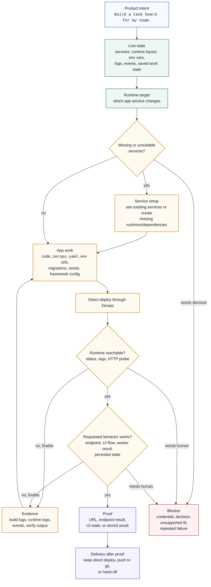

The ZCP MCP setup gives a coding agent an operating loop for Zerops app work. The agent reads live state, chooses the app runtime and dependencies, changes the app, deploys through Zerops, verifies real behavior, and returns proof or a blocker.

The loop is carried by bounded Zerops operations, Zerops-specific knowledge, and instructions for what to inspect, what to change, when to ask, and what counts as done. You describe the product outcome; the agent uses the loop to make its decisions visible while it works.

The source of truth is the real project: runtimes, managed services, env references, logs, events, and deploy results. A separate preview sandbox is not the source of truth.

## The control loop



The loop keeps the agent working from evidence instead of a guessed checklist: current state, Zerops wiring rules, deploy evidence, and the distinction between proof and blocker.

## What "live state" means

The MCP tools read Zerops instead of asking you to paste a service inventory into the prompt. Useful state includes:

- runtime services and managed services,
- whether the app has one runtime, a dev+stage pair, or local files linked to a Zerops runtime,
- env-var keys and Zerops references,
- recent build/deploy events,
- build logs, runtime logs, and verification output,
- saved work state after an interrupted session.

This is why a short prompt can be enough. The agent can ask what exists, which runtime was last deployed, which checks passed, and where a previous run stopped.

Chat history is not the source of truth. If the agent sounds confused, starts from an old assumption, or a session was interrupted, the recovery move is:

```text
Read current project status and tell me where this project stands before changing anything.
```

## What the workflow coordinates

The generated workflow is opinionated about the concerns an agent must resolve during app work. You usually do not name them in the prompt. The tools and instructions supply the state, guidance, operations, and done criteria so the agent can work from evidence.

| Concern          | What the agent gets                                                                                                 | What that means for you                                                       |
| ---------------- | ------------------------------------------------------------------------------------------------------------------- | ----------------------------------------------------------------------------- |
| Live state       | Services, env-var keys, Zerops references, recent events, logs, verification output, and saved work state.          | You do not have to paste a service inventory or reconstruct what happened.    |
| Runtime target   | Rules for choosing the app runtime that should receive code changes.                                                | The agent can identify where app work belongs before editing or deploying.    |
| Managed services | Knowledge and env wiring patterns for database, cache, queue, search, storage, mail, and similar services.          | Product intent can imply real dependencies without a manual wiring checklist. |
| Service setup    | Operations for using existing services or creating missing runtimes and dependencies.                               | Runtime layout and dependencies can be established before app work starts.    |
| App wiring       | Zerops-specific rules for `zerops.yaml`, env references, ports, commands, public access, and build/deploy behavior. | The app is wired for Zerops rather than for a generic cloud template.         |
| Deploy evidence  | Build logs, runtime logs, platform events, service status, HTTP checks, and structured verification output.         | A failed deploy becomes a diagnosis surface instead of guesswork.             |
| Behavior proof   | A done gate based on the requested behavior, not only on a successful build or reachable root URL.                  | The final answer can point to what was actually checked.                      |
| Delivery handoff | Direct proof first; then git push, CI, or human handoff when that is the chosen delivery choice.                    | Shipping setup follows a verified running result.                             |

The exact labels for layouts, delivery modes, and setup routes live in the [Glossary](/zcp/glossary) and [Workflows in depth](/zcp/reference/agent-workflow).

## Service setup prepares the project layout

Before app code work starts, the workflow makes three decisions visible:

- Which runtime service is the app target?
- Which managed services are dependencies?
- Does the existing project layout fit the request?

If the services already exist, the agent can use them. If a needed runtime or dependency is missing, the tools can create it. If the choice affects cost, product scope, credentials, a destructive action, or which stage/runtime should be used, the agent should stop and ask.

Service setup is finished when the app runtime and dependencies are known. It is the layout that lets app work happen in the right place.

## App work changes code and platform wiring together

After the runtime target is known, the agent gets the platform knowledge needed to make the application change. In practice this often spans both source code and Zerops wiring:

- app files,
- `zerops.yaml` build and run setup,
- env references to managed services,
- migrations, seeds, and framework config,
- start commands, ports, and public HTTP support,
- local `.env` generation when using local setup.

That guidance matters because Zerops is its own platform. Service references, build/deploy behavior, public access, scaling, and env resolution do not follow Docker Compose or Kubernetes conventions.

The first functional deploy goes directly through MCP so the agent has a running result to verify. A repository push or CI handoff can follow, but it should not replace the first proof.

## Recovery is evidence-driven

When something fails, the agent has the evidence surface that matches the failure:

| Failure pattern          | Useful evidence                                                                                              |
| ------------------------ | ------------------------------------------------------------------------------------------------------------ |
| Build failed             | Build logs, build commands, dependency manifests, deploy file list.                                          |
| Runtime failed to start  | Runtime or prepare logs, start command, ports, env references.                                               |
| Route or behavior failed | Verify output, HTTP response, runtime logs at request time, stored state.                                    |
| Network access failed    | VPN, SSH, DNS, subdomain readiness, service status, named transport error.                                   |
| Config was rejected      | Field-level rejection, `zerops.yaml`, setup name, env reference, service settings.                           |
| Credential failed        | The named credential surface: Zerops token, git token, SSH, managed-service credential, or external API key. |

Retrying the same deploy without new evidence is not progress. The loop pushes toward one of three outcomes: fix from a cause, ask for the missing decision, or report a blocker with the category, evidence read, and attempts made.

## Verification has two layers

A successful deploy proves that Zerops accepted the build and started the runtime. Reachability checks prove the service is running and reachable. They still do not prove the product request.

For a task-board app, useful behavior proof might be:

- create a task,
- move it between columns,
- refresh the page,
- confirm the task is still there.

For an API task, proof might be a JSON response from the requested endpoint and stored data behind it. For a worker task, proof might be a processed job and the resulting database or object-storage state. For a staging request, proof belongs on the stage runtime, not only on dev.

The final answer should make proof inspectable: runtime name, URL or endpoint, behavior checked, and delivery choice if one was set.

## Delivery happens after proof

Delivery choice controls how future changes ship after a verified runtime exists:

| Choice             | Use when                                                                       |
| ------------------ | ------------------------------------------------------------------------------ |
| Keep direct deploy | Early development, demos, dev/stage iteration, or agent-owned runtime changes. |
| Push to git        | You want commits, review, repository history, or a repo-triggered build.       |
| External handoff   | CI, release management, or a human owns the next deploy.                       |

Packaging a running service turns a deployed runtime into a re-importable bundle for another Zerops project. It is useful for handoff or reuse after proof, not for deploying the next app change; see [Package a running service](/zcp/workflows/package-running-service).

## Remote and local setup use the same loop

The same `zcp` binary can run in two places. The control loop stays the same; filesystem and network access change. A human can take over from the same evidence either way: files, runtime target, logs, events, verification result, and delivery state.

| Setup        | What runs where                                                                                                                                             | Practical effect                                                                                                                                                                                     |
| ------------ | ----------------------------------------------------------------------------------------------------------------------------------------------------------- | ---------------------------------------------------------------------------------------------------------------------------------------------------------------------------------------------------- |
| Remote setup | A `zcp@1` service runs the `zcp` binary inside Zerops. **Include Coding Agent** adds the bundled agent CLI; **Cloud IDE** adds Browser VS Code. | Work happens inside the remote workspace, with private networking and runtime file mounts. |
| Local setup  | The `zcp` binary runs on your laptop after `zcp init`, and your local editor or CLI agent talks to it.                                         | App files, deploy source, and git credentials stay local. Managed services are reached over Zerops VPN, and `.env` generation bridges credentials into your local app. |

Choose setup by where the agent and filesystem should live: [Remote or local setup](/zcp/setup/choose-workspace).

## Signs of a healthy run

A well-shaped run should:

- name the runtime target before editing or deploying,
- use existing services when they fit,
- create missing services only before app work starts,
- read logs, events, and verify output when failure occurs,
- distinguish runtime reachability from requested behavior,
- stop before destructive actions, ambiguous runtime/stage choices, or missing credentials,
- end with proof or a blocker.

That is the practical difference between "the agent wrote code" and "the app task is done".

## Next steps

- [Build and ship](/zcp/workflows/build-with-zcp) - normal app work after setup.
- [Workflows in depth](/zcp/reference/agent-workflow) - process gates, generated files, runtime layouts, delivery terms, and completion evidence.
