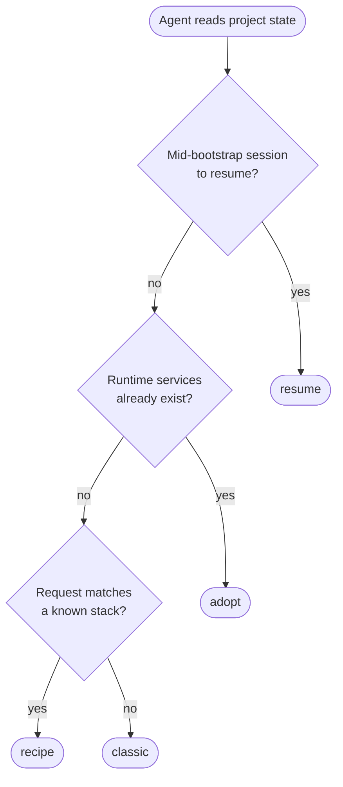
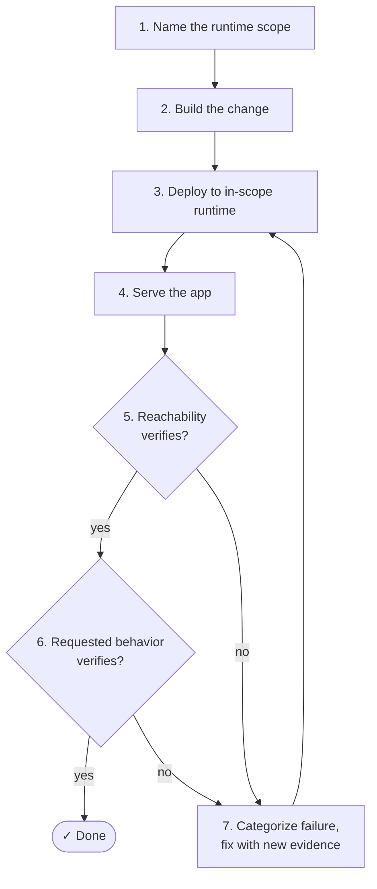

The canonical contract for an agent operating against ZCP MCP — what a session looks like, the layers it touches, the failures it classifies, the tools it calls, and what counts as done. The shape is explicit so you can predict what happens next, audit what happened, and recover when something goes wrong.

Background — what ZCP is and how it fits into a project: [Infrastructure for Coding Agents](/features/coding-agents). Mental model: [How ZCP works](/zcp/concept/how-it-works).

## Three layers a session touches

Most workflow mistakes come from confusing these:

| Layer | What it is | What changes go here |
|---|---|---|
| **Workspace** | Where the MCP runs — the `zcp@1` hosted service in the project, or the `zcp` binary on your laptop. Carries the integration token. In hosted mode, also runs the bundled agent CLI; in local mode the agent runs in your editor and talks to the MCP. | None — code changes don't target the workspace itself. |
| **Target runtime service** | The app's runtime — `appdev`, `appstage`, `app`. SSHFS-mounted into the hosted workspace, or in your local checkout for the local bridge. | App files, `zerops.yaml`, deploys. |
| **Managed services** | Databases, caches, search, queues, object storage. Provide connection details. | Schema migrations and data, never application code. |

The most common mistake is targeting the workspace as the deploy destination. The workspace isn't the application — it's the place the agent operates from.

## Bootstrap routes

Before any code change, the agent reads what's already in the project and picks one of four routes. The agent should tell you which it picked.

| Route | Use when | Wrong signal |
|---|---|---|
| `adopt` | App runtime services already exist (most common, includes any recipe-based project) | Recreating services that exist, or treating the workspace as the target |
| `recipe` | Project is empty (or has only the workspace) and the request matches a known stack | Deploying the unchanged starter as if it were the finished product |
| `classic` | Project is empty and the request needs a custom service plan | Writing app code before service ownership is settled |
| `resume` | A previous session was interrupted mid-bootstrap | Starting from scratch without acknowledging existing state |

Bootstrap completes when services are known and (in hosted) mounted; develop follows.

## Develop flow

A fixed sequence so progress is auditable. The loop closes when both verification layers pass.

1. **Name the runtime scope.** State which runtime the change targets (`appdev`, `appstage`, etc.). For `appdev` + `appstage` pairs, work scoped to `appdev` doesn't touch `appstage` unless promotion was explicitly requested.
2. **Build the requested change.** Code edits and `zerops.yaml` updates as needed.
3. **Deploy to the in-scope runtime.** First deploy uses the direct path; delivery style is decided later.
4. **Serve the app.** Start or restart the process if needed — dynamic dev runtimes may need explicit start/restart after deploy.
5. **Verify runtime reachability.** Platform-level health check.
6. **Verify the requested behavior.** Application-level check against the actual endpoint, UI, or stage URL.
7. **Fix and redeploy if needed.** Categorize the failure (below) and retry with new evidence, not the same attempt with hope.

Steps 5 and 6 aren't interchangeable. A green deploy with a 500 on the relevant route isn't done.

## Verification layers

| Layer | What it checks |
|---|---|
| **Runtime reachability** | Platform health check — process alive, port bound, service answers. |
| **Requested behavior** | A real request against the actual endpoint, UI, or stage URL. Status codes alone aren't enough if the body is wrong. |

Both must pass before a session reports completion.

## Failure categories

When something fails, the agent labels the failure with one of these tags. The tag drives the retry strategy and is what you read in the session log. This is the canonical home for the categories — other pages link here.

| Category | What it means | Typical fix direction |
|---|---|---|
| `build` | Build phase failed (compile error, missing dependency, build command exit non-zero) | Inspect build log; fix `zerops.yaml` build steps or source |
| `start` | Container started but the process crashed or exited | Inspect runtime log; fix start command, init commands, or app entry |
| `verify` | Process started but reachability or behavior verification failed | Distinguish between unreachable port and wrong response |
| `network` | Service-to-service network problem (hostname unresolved, port closed, VPN-only access expected) | Confirm hostnames, ports, isolation settings |
| `config` | `zerops.yaml`, env vars, or service settings inconsistent with what the code expects | Reconcile config with code; document the contract |
| `credential` | Auth failure against a managed service or external API | Rotate or correct credentials; verify the credential surface (env var, git token, SSH key) matches what the failing call expects |
| `other` | Doesn't fit the categories above | Log details and escalate; agent shouldn't loop on unknown failures |

Categorization is the discipline that turns retries into evidence-driven fixes. Repeating the same deploy with the same code on a `start` failure is a bug in the loop, not a recovery strategy.

Recovery moves and symptom→category mapping: [Troubleshooting](/zcp/reference/troubleshooting).

## Workspace shapes

A project's runtime shape determines what "deploy" and "promote" mean during the develop flow. The agent identifies the shape from project state; you almost never pick directly.

| Shape | Topology | Use case |
|---|---|---|
| `standard` | Dev runtime + stage runtime (e.g. `appdev` + `appstage`) | Separation between development and production-like environments |
| `dev` | One mutable development runtime | Fast experimentation, no separate staging |
| `simple` | Single runtime, no dev/stage pair | Small apps, static sites, simple APIs |
| `local-stage` | Local checkout + one Zerops runtime as the stage target | Local hot reload + deploys to a Zerops stage runtime |
| `local-only` | Local checkout, no Zerops runtime linked yet | Project is local-only or has only managed services |

In `standard`, **stage is a promotion target only**. Changes scoped to `appdev` don't automatically reach `appstage`; promotion happens when the user asks for it. Conflating the two is the most common semantic error in `standard` projects.

Decision context (hosted vs local, when each shape fits): [Choose your workspace](/zcp/setup/choose-workspace#workspace-shapes).

## Delivery contracts

After a verified deploy, the agent picks a contract that describes how *future* changes will be delivered. This isn't a flag affecting the current work — it's an agreement about what comes next.

| Contract | Meaning |
|---|---|
| `auto` | Future work continues on the direct Zerops deploy path |
| `git-push` | Future work is committed and pushed to a configured remote; the resulting build is observed via webhook or GitHub Actions |
| `manual` | A human or external CI takes over delivery from here |

For `git-push`, the agent observes the build result (webhook or Actions run) and records it before reporting the session complete. A push without a verified build result isn't a finished session.

Plain-language framing of the same choice: [Choose how finished work ships](/zcp/workflows/delivery-handoff).

## MCP tool surface

The MCP exposes a fixed set of operations grouped into three tags. Host agents read the tags and apply policy — typically auto-allow read-only, require approval for destructive, ask once per operational tool.

### Read-only — inspect state and configuration

Safe to call without confirmation. Integration tokens can be scoped to read-only operations for CI jobs.

| Tool | Purpose |
|---|---|
| `zerops_logs` | Stream runtime or build logs filtered by hostname, severity, time, search text |
| `zerops_events` | Project event timeline (deploys, builds, scaling, status transitions), scoped by hostname |
| `zerops_discover` | Read services, ports, env-var keys, current state from live platform reality |
| `zerops_verify` | Post-deploy reachability and HTTP-probe checks |
| `zerops_knowledge` | Surface ZCP-side guidance specific to current project state and step |

### Destructive — mutate the project or its services

Host agent should require user confirmation. Two operations carry an explicit ZCP-side gate (see Confirmation gates).

| Tool | Purpose |
|---|---|
| `zerops_deploy` | Ship code through the build and deploy pipeline |
| `zerops_scale` | Adjust resources or HA/NON_HA mode on a managed or runtime service |
| `zerops_env` | Read/set/delete env variables at service or project scope |
| `zerops_delete` | Delete a service entirely (gated, requires named approval) |
| `zerops_manage` | Lifecycle operations — start, stop, restart, reload |

### Operational — set up or coordinate work

Host agent decides per team policy. These don't fit cleanly as read-only or destructive; they're setup-shaped.

| Tool | Purpose |
|---|---|
| `zerops_recipe` | Apply a Zerops recipe to provision a known stack |
| `zerops_mount` | Manage SSHFS mounts of runtime services (hosted workspace with Cloud IDE only) |
| `zerops_subdomain` | Enable, disable, or inspect public subdomain access on a service |
| `zerops_workflow` | Coordinate the bootstrap → develop → deliver workflow state |
| `zerops_dev_server` | Run a long-lived dev process inside another project container (hosted workspace with Cloud IDE only) |

## Confirmation gates

Two operations carry an explicit ZCP-side confirmation gate because the loss isn't reversible from inside the conversation:

- **Service deletion** — requires explicit user approval in the same conversation, by service name. Hosted ZCP additionally hard-blocks deleting the workspace it's running on (`SELF_SERVICE_BLOCKED`).
- **Wholesale service replacement** (import override) on a service with prior failed deploy history — first call is refused with a structured payload; second call must echo it back.

Detail: [Tokens and credentials → Confirmation gates](/zcp/security/tokens-and-project-access#confirmation-gates-for-destructive-actions).

## Practical rules

- **Existing recipe projects** — adopt existing services rather than recreating.
- **Bootstrap before develop** — services must be known (and, in hosted, mounted) before develop starts.
- **First deploy uses the direct path** — delivery style is decided after the first deploy is verified.
- **Dynamic dev runtimes** — may need explicit start, restart, or process inspection after deploy.
- **Built-in webserver** — runtimes that ship with one don't need a separate dev-server step.
- **Runtime health vs requested behavior** — they aren't the same; both must pass.
- **Completion evidence** — a finished session shows a verified deploy on the in-scope runtime, *or* a clearly-stated blocker the user can act on.

## Auditing a session

A session is well-shaped if you can answer all of these from its log:

- Whether existing or new services were used (route).
- Which runtime scope, workspace shape, and route were chosen.
- Where bootstrap ended and develop began.
- Whether the dev process started or was deliberately skipped.
- What URL, endpoint, or visible behavior proved success.
- Which delivery contract governs future changes.

If any are unclear, the session under-explained itself. That's a fix-it-next-time signal, not a correctness failure.

Step-by-step audit playbook with the evidence-coverage matrix and take-over decision tables: [Auditing agent work](/zcp/security/auditing-agent-work).
