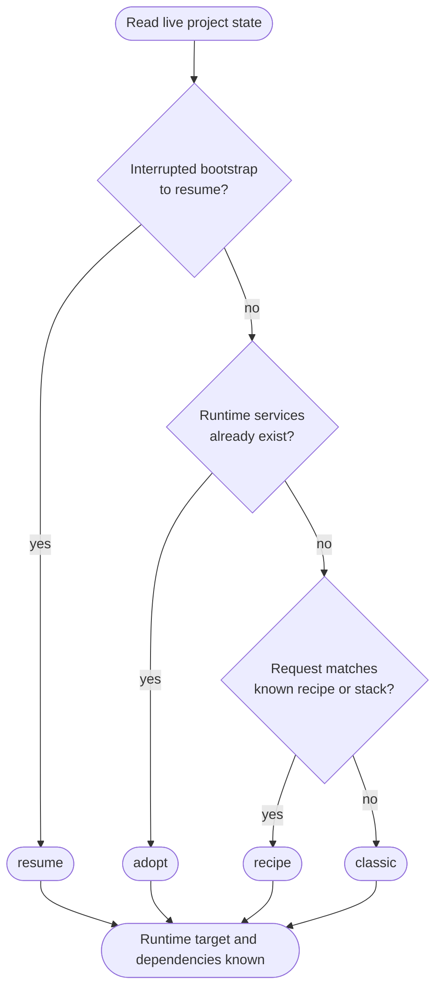
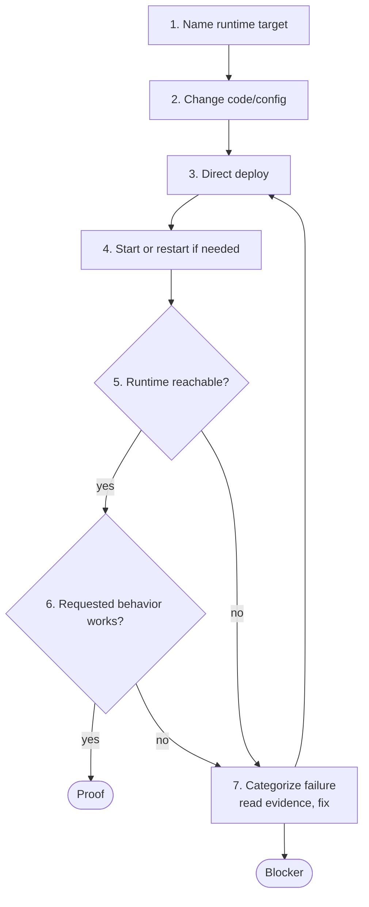

Use this page when you want to understand the process behind workflow-guided agent work. Normal prompts should still describe outcomes. The workflow exists so the agent can read the project, prepare the right runtime and services, make the app change, deploy, verify, recover from evidence, and stop with proof or a concrete blocker.

The useful mental split is:

| Phase | What it settles | What should be true when it ends |
| ----- | --------------- | -------------------------------- |
| **Bootstrap** | Where the app should run and which services it depends on. | Runtime target and managed dependencies are known. |
| **Develop** | Code, `zerops.yaml`, env wiring, deploy, verification, recovery, and delivery choice. | The requested behavior is proved, or the blocker is concrete. |

Bootstrap is not a marketing or onboarding step. It is the workflow's name for "make the project layout safe to work in before changing app code."

## Session layers

Most workflow mistakes come from confusing these layers:

| Layer | What it is | What changes here |
| ----- | ---------- | ----------------- |
| **Workspace** | Where `zcp` and the agent run: remote `zcp@1` service or local machine. | Agent config, tools, local workflow state. App code should not be deployed to the workspace itself. |
| **Target runtime service** | The app runtime in scope: `appdev`, `appstage`, `app`, or a linked local deploy target. | App files, `zerops.yaml`, deploys, runtime logs, verification target. |
| **Managed services** | Databases, caches, queues, search, storage, mail, and similar dependencies. | Schema/data operations and credentials, never app code deploys. |

The `zcp` service is the control surface, not the app runtime.

## What drives the workflow

The workflow-guided experience is made from four pieces:

| Piece | Role |
| ----- | ---- |
| **MCP tools** | Project-scoped Zerops operations: discover, deploy, read logs/events, manage env vars, verify, import/export, and related actions. |
| **Generated instructions** | Agent policy for when to inspect, when to ask, when to deploy, what evidence to read, and what counts as done. |
| **Saved workflow state** | Local metadata about bootstrap sessions, runtime pairing, delivery choice, deploy attempts, verify attempts, and interrupted work. |
| **Live Zerops project** | Source of truth for services, status, env refs, logs, events, deploys, runtime files, and public access. |

The workflow does not replace judgment from the user or the agent. It gives the agent a process and evidence surface so app work does not depend on stale chat memory or a pasted runbook.

## Bootstrap

Bootstrap starts before app code changes when the workflow needs to understand or prepare the project layout.

| Route | Use when | Wrong signal |
| ----- | -------- | ------------ |
| `adopt` | Runtime services already exist, including recipe-created projects. | Recreating services that already fit, or targeting the `zcp` service as the app. |
| `recipe` | The project is empty or only has remote setup, and the request matches a known stack recipe. | Treating an unchanged starter as the finished requested product. |
| `classic` | The project is empty and needs a custom service plan. | Writing app code before service ownership and runtime target are known. |
| `resume` | A previous bootstrap was interrupted. | Starting from scratch without checking live services and saved state. |

Bootstrap ends when the app runtime target and managed dependencies are known. It should also make visible any choice that needs human judgment: cost, credentials, data, runtime layout, production risk, or destructive behavior.

## Runtime layouts

Runtime layout describes which app runtime services the workflow should use. Zerops service scaling mode, such as `HA` or `NON_HA`, is a separate service setting.

| Layout | Meaning | Typical names |
| ------ | ------- | ------------- |
| `standard` | Separate dev and stage runtime services. Development usually starts on dev; stage is explicit. | `appdev` + `appstage` |
| `dev` | One mutable development runtime. | `appdev` |
| `simple` | One runtime with no dev/stage split. | `app` |
| `local-stage` | Local source directory linked to one Zerops runtime for deploys. | local directory + `appstage` |
| `local-only` | Local source directory with no linked deploy target yet. | local directory |

In `standard`, stage is explicit. Work scoped to `appdev` does not silently touch `appstage`; promotion or stage verification happens when the user asks for it.

## Develop

Develop is the main app-work loop. It begins after bootstrap has a runtime target and dependencies. It closes only when runtime reachability and requested behavior both pass, or when the agent has a blocker that needs a human decision.

1. **Name runtime target.** State which runtime is in scope: `appdev`, `appstage`, `app`, or a linked local target.
2. **Change code and config.** Edit app files, `zerops.yaml`, env references, migrations, seeds, framework config, or local `.env` bridge when needed.
3. **Deploy directly first.** The first verified runtime deploy goes through MCP tools. Git or CI handoff comes after proof.
4. **Start or restart if needed.** Dynamic dev runtimes may need an explicit start or restart after deploy. Built-in webserver runtimes do not need a separate dev-server step unless the framework requires one.
5. **Verify runtime reachability.** Check service status, recent error logs, and HTTP readiness when the runtime is an HTTP service.
6. **Verify requested behavior.** Check endpoint body, UI state, job result, persisted data, or another result tied to the user request.
7. **Fix from evidence.** Read failure category, logs, events, and check output. Repeating the same deploy without new evidence is not progress.

Reachability and requested behavior are separate gates. A green deploy with a broken route is not done.

## Failure categories

Failure categories point the agent to the first useful evidence surface.

| Category | What it means | Read first |
| -------- | ------------- | ---------- |
| `build` | Build phase failed. | Build logs, build commands, dependency manifests, deploy file list. |
| `start` | Build passed, but runtime start or prepare failed. | Prepare/runtime logs, start command, ports, env references. |
| `verify` | Runtime exists, but reachability or behavior failed. | Failing check detail, HTTP response, request-time runtime logs, behavior evidence. |
| `network` | Transport, DNS, VPN, SSH, or service-to-service reach failed. | VPN, SSH, DNS, subdomain readiness, service status, named transport error. |
| `config` | `zerops.yaml`, env vars, setup block, or service settings mismatch. | Field-level rejection, setup name, env reference, service settings. |
| `credential` | Zerops, git, SSH, managed-service, or external API credential failed. | The named credential surface. |
| `other` | No known category matched. | Raw event/log evidence; stop if repeated without a new signal. |

Categorization is what turns retries into evidence-driven fixes. The practical recovery flow lives in [Troubleshooting](/zcp/reference/troubleshooting).

## Delivery after proof

Delivery mode applies after a verified deploy. It does not replace the first proof.

| Exact mode | User-facing choice | Meaning |
| ---------- | ------------------ | ------- |
| `auto` | Keep direct deploy | The agent keeps deploying future changes directly to the target runtime. |
| `git-push` | Push to git | The agent commits and pushes to a configured remote; any resulting build still needs observation and verification. |
| `manual` | External handoff | CI, release process, or a human owns future delivery; the workflow records evidence but does not initiate the next deploy. |

Git-push capability, delivery mode, and build integration are separate. A project can have git-push configured while still using direct deploy for a given session.

Packaging and production promotion are deliberate handoffs after proof. Packaging turns a verified runtime into a git-backed import bundle. Production promotion moves verified work into a separate production project through GUI setup, git/CI triggers, or the team's release process.

## Generated files and state

Remote setup and `zcp init` create configuration around the MCP server and workflow guidance.

| File or directory | Created where | Purpose |
| ----------------- | ------------- | ------- |
| `CLAUDE.md` | Remote workspace or local project directory | Claude Code instruction surface. ZCP MCP writes a managed block between `<!-- ZCP:BEGIN -->` and `<!-- ZCP:END -->`. User content outside that block is preserved. |
| `.claude/settings.local.json` | Remote workspace or local project directory | Claude Code per-project settings and ZCP MCP tool permissions for that directory. |
| `.mcp.json` | Local project directory | Project-local MCP server config. It contains the local `zcp` command and the project-scoped `ZCP_API_KEY`; keep it out of git. |
| `~/.claude.json` and SSH config | Remote setup | Workspace-level Claude Code and SSH wiring used inside the Zerops-hosted workspace. |
| `.zcp/state/` | Working directory where the MCP server runs | Workflow state and service metadata for that project directory. |

The managed `CLAUDE.md` block is refreshed by `zcp init` and by the MCP server when the block already exists. Put durable project instructions outside the ZCP markers. Edits inside the managed block are treated as generated content.

`.zcp/state/` is not application source code and should not be committed. It stores metadata such as known runtime services, local/stage pairing, delivery preference, git-push setup, build integration, first-deploy stamps, workflow sessions, deploy attempts, verify attempts, and local coordination locks.

ZCP MCP does not use `.zcp/state/` as a stale copy of the Zerops project. Service status, logs, events, runtime files, env-var values, and current platform configuration are read from Zerops or from the local filesystem when tools run. Local `.env` files are generated separately and may contain secrets.

Do not edit `.zcp/state/` by hand during normal work. Use workflow operations to reset, resume, iterate, or reconfigure state. Deleting it intentionally discards local memory of services and delivery setup for that directory; the tools can rediscover live Zerops state, but delivery preferences and workflow history may need to be set again.

## Completion evidence

A completed app task should answer:

- which bootstrap route was used when setup was needed,
- which runtime target changed,
- which managed services were used or created,
- which deploy passed,
- which reachability check passed,
- which requested behavior passed,
- which URL, endpoint, UI state, worker result, or stored value proves it,
- which delivery choice applies next,
- or which blocker remains and what evidence supports it.

A clear blocker is acceptable completion only when it names the runtime in scope, failure category, evidence read, fixes tried, and human decision or credential still needed.

## Confirmation gates

Some operations pause because the loss is not safely reversible from inside the conversation:

- **Service deletion** requires explicit user approval in the current conversation, by service name.
- **Destructive import override** first refuses and names what would be replaced; a second call must acknowledge the same targets.

See [Tokens and credentials](/zcp/security/tokens-and-project-access#what-zcp-enforces-for-destructive-actions) for the user-facing confirmation flow.

## Auditing a workflow

A workflow-guided run is well-shaped if the evidence answers:

| Question | Evidence |
| -------- | -------- |
| Where did bootstrap start? | Live service list, saved workflow state, and bootstrap route. |
| Where did bootstrap end? | Runtime target, managed dependencies, and any human decisions. |
| Which runtime was developed and deployed? | Runtime target, deploy result, events, and logs. |
| What proved reachability? | Verify output, service status, public URL, or HTTP probe. |
| What proved behavior? | Endpoint, UI flow, job result, database/object state, or other requested proof. |
| What controls future delivery? | Delivery mode, git-push state, build integration, package bundle, or production handoff note. |

## Next steps

- [ZCP MCP tools](/zcp/reference/mcp-operations) - operation names and direct tool calls.
- [Troubleshooting](/zcp/reference/troubleshooting) - recovery order when a run gets stuck.
- [Glossary](/zcp/glossary) - exact terms used across the ZCP MCP reference.
