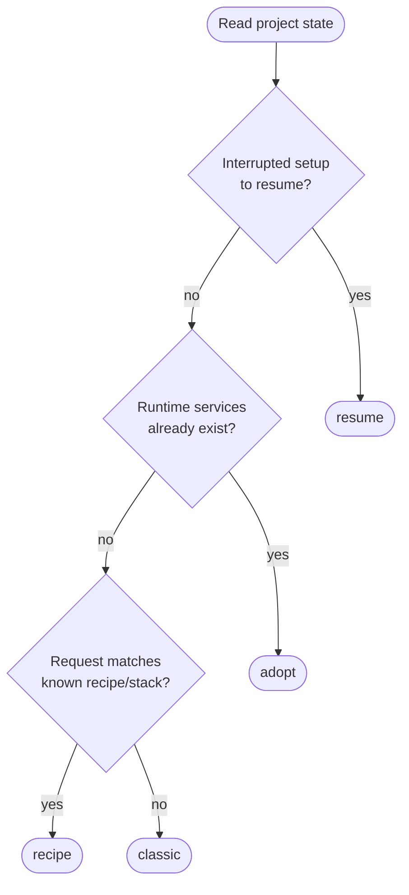
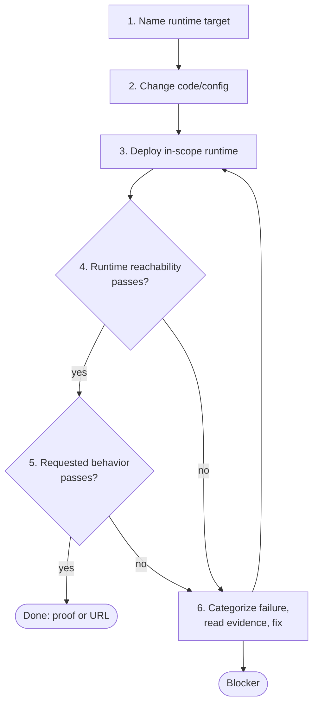

Exact vocabulary for ZCP reference, audits, policies, and handoffs. Day-to-day prompts should describe outcomes.

## Session layers

Most workflow mistakes come from confusing these layers:

| Layer                  | What it is                                                                     | What changes here                                               |
| ---------------------- | ------------------------------------------------------------------------------ | --------------------------------------------------------------- |
| ZCP setup              | Where ZCP runs: remote `zcp@1` service or local `zcp` binary.                  | No app code should be deployed to the setup itself.             |
| Target runtime service | The app runtime: `appdev`, `appstage`, `app`, or a linked local deploy target. | App files, `zerops.yaml`, deploys.                              |
| Managed services       | Databases, caches, queues, search, storage, mail.                              | Schema/data operations and credentials, never app code deploys. |

The `zcp` service is the control surface, not the app runtime.

## Service setup routes

Before app code work starts, ZCP reads live state and chooses a setup route. The route is an implementation detail in first-read docs, but it is useful in reference and audits.

| Route     | Use when                                                                            | Wrong signal                                                               |
| --------- | ----------------------------------------------------------------------------------- | -------------------------------------------------------------------------- |
| `adopt`   | Runtime services already exist, including recipe-created projects.                  | Recreating services that exist, or targeting `zcp` as the app.             |
| `recipe`  | The project is empty or only has ZCP, and the request matches a known stack recipe. | Deploying an unchanged starter as if it were the requested product.        |
| `classic` | The project is empty and needs a custom service plan.                               | Writing app code before service ownership and runtime target are known.    |
| `resume`  | A previous setup was interrupted.                                                   | Starting from scratch without acknowledging live services and saved state. |

Service setup stops when app runtimes and managed dependencies are known. App code, `zerops.yaml`, and the first deploy belong to the develop flow.

## Develop flow

The develop loop is the main ZCP work cycle. It closes only when reachability and requested behavior both pass.

1. **Name runtime target.** State which runtime is in scope (`appdev`, `appstage`, `app`, or linked local target). In dev+stage projects, dev work does not imply stage unless requested.
2. **Change code/config.** Edit app files, `zerops.yaml`, env references, migrations, seeds, or framework config.
3. **Deploy directly first.** The first verified runtime deploy goes through ZCP directly. Delivery setup is applied after a verified running result exists.
4. **Verify runtime reachability.** Service status, recent error logs, and HTTP probe for eligible runtime services.
5. **Verify requested behavior.** Endpoint body, UI state, job result, persisted data, or another check tied to the user request.
6. **Fix from evidence.** Read classification, logs, events, and check output. Repeating the same deploy without new evidence is not progress.

Dynamic dev runtimes may need an explicit start or restart after deploy. Built-in webserver runtimes do not need a separate dev-server step unless the framework requires one.

## Runtime layouts

Runtime layout describes which app runtime services ZCP should use. Zerops service scaling mode, such as `HA` or `NON_HA`, is a separate service setting.

| Layout        | Meaning                                                                                        | Typical names                |
| ------------- | ---------------------------------------------------------------------------------------------- | ---------------------------- |
| `standard`    | Separate dev and stage runtime services. Development usually starts on dev; stage is explicit. | `appdev` + `appstage`        |
| `dev`         | One mutable development runtime.                                                               | `appdev`                     |
| `simple`      | One runtime with no dev/stage split.                                                           | `app`                        |
| `local-stage` | Local source directory linked to one Zerops runtime for deploys.                               | local directory + `appstage` |
| `local-only`  | Local source directory with no linked deploy target yet.                                       | local directory              |

The stage hostname comes from live state. ZCP should not invent it from the dev hostname.

## Delivery modes

Delivery mode applies after a verified deploy and describes how future changes ship. It does not redirect the first successful deploy.

| Exact mode | User-facing choice | Meaning                                                                                                            |
| ---------- | ------------------ | ------------------------------------------------------------------------------------------------------------------ |
| `auto`     | Keep direct deploy | ZCP keeps deploying future changes directly to the target runtime.                                                 |
| `git-push` | Push to git        | The agent commits and pushes to a configured remote; any resulting build still needs observation and verification. |
| `manual`   | External handoff   | CI, release process, or a human owns future delivery; ZCP records evidence but does not initiate the next deploy.  |

Git-push capability, delivery mode, and build integration are separate. A project can have git-push configured while still using direct deploy for a given session.

## Failure categories

| Category     | Meaning                                                               | Read first                                             |
| ------------ | --------------------------------------------------------------------- | ------------------------------------------------------ |
| `build`      | Build phase failed.                                                   | Build logs and build commands.                         |
| `start`      | Build passed, runtime failed to start or crashed.                     | Prepare/runtime logs and start command.                |
| `verify`     | Runtime exists but reachability or behavior failed.                   | Failing check detail and runtime logs at request time. |
| `network`    | Transport, DNS, VPN, SSH, or service-to-service reach failed.         | Transport error and failed network access.             |
| `config`     | `zerops.yaml`, env vars, setup block, or service settings mismatch.   | Structured rejection detail and config files.          |
| `credential` | Zerops, git, SSH, managed-service, or external API credential failed. | The named credential surface.                          |
| `other`      | No known category matched.                                            | Raw event/log evidence; stop if repeated.              |

Categorization is what turns retries into evidence-driven fixes. Recovery moves and symptom mapping live in [Troubleshooting](/zcp/reference/troubleshooting).

## Completion evidence

A completed app task can answer:

- which services were used or created,
- which runtime target changed,
- which deploy passed,
- which reachability check passed,
- which user-requested behavior passed,
- which URL, endpoint, UI state, or stored result proves it,
- which delivery mode applies next,
- or which blocker remains and what evidence supports it.

A green build with a broken route is not completion. A clear blocker is acceptable completion only when it names the failure category, evidence read, fixes tried, and human decision or credential still needed.

## Practical rules

- Use existing services when they fit; do not recreate them just to get a clean slate.
- Bootstrap/service setup is not app work; app files and first deploy happen in develop.
- First functional deploy is direct; git/CI/handoff comes after proof.
- Managed services are dependencies, not deploy targets.
- Stage is explicit in `standard` projects; dev changes do not silently promote.
- Runtime health and requested behavior are separate verification gates.
- Stop on repeated failure without new evidence, missing credentials, ambiguous runtime target, or destructive recovery.

## Auditing a session

A session is well-shaped if platform evidence and the agent report answer:

| Question                                        | Evidence                                                                  |
| ----------------------------------------------- | ------------------------------------------------------------------------- |
| Which setup route and runtime layout were used? | ZCP status, service metadata, service list.                               |
| Where did service setup end and app work begin? | Work-session state, deploy history, file changes.                         |
| Which runtime was deployed and verified?        | Service events, deploy result, verify output.                             |
| What behavior proved success?                   | Endpoint/UI/job/data proof in the final report.                           |
| What controls future delivery?                  | Delivery mode, git-push state, build integration, or manual handoff note. |

Operation-name reference lives in [Advanced operations](/zcp/reference/mcp-operations). Recovery shortcuts live in [Troubleshooting](/zcp/reference/troubleshooting).
