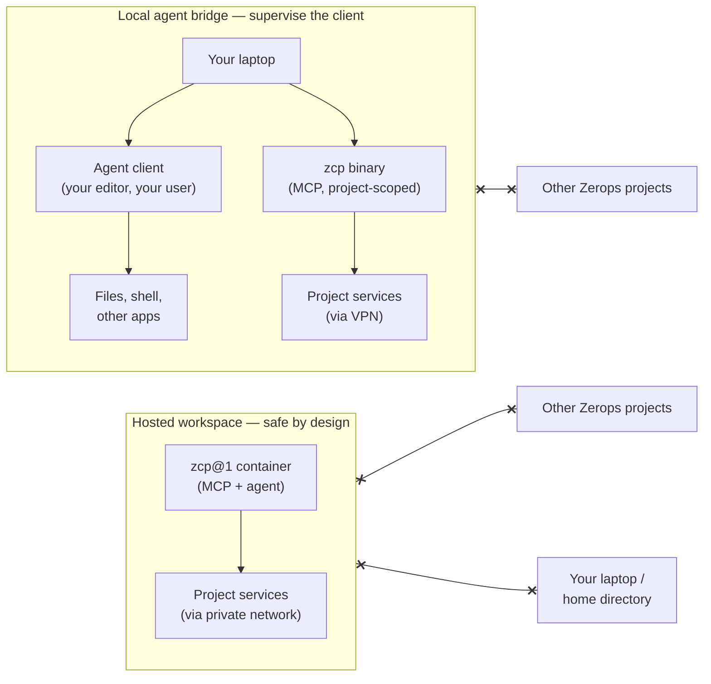

ZCP gives a coding agent project-scoped power inside one Zerops project. Same control plane, two ways to run it — and the blast radius is different. That difference is the headline of this page.

## Hosted workspace or local agent bridge — two different blast radii

|  | Hosted workspace | Local agent bridge |
|---|---|---|
| Where the agent runs | A `zcp@1` service container in your project | Your laptop |
| What it can touch | The container, project services, project token, and (when requested) runtime filesystems via SSHFS mounts | The same project surface, **plus whatever the agent client can reach on your laptop** |
| Network reach | The project's private network | Project services over VPN; everything else your laptop can already reach |
| Safety profile | **Safe by design** — structural isolation; no path to your laptop, home directory, or other projects | **Supervise the agent client** — ZCP stays project-scoped, but the agent process inherits your user |

Either path is the right choice in context. The local bridge fits when you want to keep your editor, dotfiles, and toolchain — recognize the security model and set the agent client's permissions accordingly.

## Project is the boundary

One ZCP process works against one Zerops project. The boundary starts at authentication: at startup, ZCP resolves the token to a project before it exposes operations. A token with access to no projects is refused; a token with access to multiple projects is refused. The intended shape is a Zerops token scoped to exactly one project.

Zerops [RBAC](/features/rbac) remains the authority. If the token can deploy, manage env vars, read logs, or operate services in that project, ZCP exposes those operations. If Zerops rejects the token for an operation, ZCP can't bypass it.

| Question | Boundary |
|---|---|
| What project can ZCP see? | The one project resolved from the token at startup. |
| What can the agent change? | Anything the token can change inside that project: runtime services, managed services, env vars, deploys, logs, lifecycle, scaling, public access. |
| What's outside reach? | Other projects, organization-wide settings, any resource Zerops RBAC doesn't grant. |
| Network scope? | The project's private network. See [Public access and private networking](/features/access). |

Project-scoped doesn't mean read-only. A full project token is still powerful inside that project — treat it like a project-level operations credential. Use it on dev/staging projects, rotate it when needed, keep it out of repositories.

## Hosted workspace specifics

The hosted workspace is the safe-by-design path. A few specifics:

- **`zcp` service ≠ runtime service.** The ZCP service is the control surface; runtime services are where your app code runs. Deploys target a runtime service, not `zcp`.
- **Two relaxed isolation flags make agent work possible.** The hosted `zcp@1` service ships with `envIsolation: none` (so it can read env from other services in the project — what lets the agent connect to your databases without you copying credentials around) and `sshIsolation: vpn service@zcp` (so it can SSH into the services you select — what makes SSHFS-mounted dev work). Both are scoped to ZCP itself; other services keep their normal isolation defaults.
- **Filesystem reach is narrower than network reach.** The agent reaches every project service over the private network, but only sees runtime files through SSHFS mounts when requested. `/var/www` is the SSHFS mount root, not an app repository.
- **A terminal in the hosted workspace has the same project-scoped power as the agent.** Convenient, and the reason the preview guidance keeps production in a separate project.
- **The editor reaches the workspace via a Zerops public subdomain.** Authentication, access logging, custom domains, and revocation follow standard [public access](/features/access) rules — the workspace isn't a special case. For VPN-only access instead, flip the per-service setting.

## Local agent bridge specifics

The local bridge is the supervise-the-client path. A few specifics:

- **Per-project files are isolated.** Each project directory has its own `.mcp.json` and `.zcp/state/`. Switching projects means switching directories; ZCP doesn't merge local state.
- **VPN setup is outside ZCP's authority.** Bringing up the Zerops VPN requires admin or root approval on your laptop. ZCP tells you the `zcli vpn up` command; it doesn't start the VPN.
- **`.env` is generated, not synced.** ZCP writes a snapshot when you ask for it. Regenerate after project env changes.
- **The local bridge doesn't protect your checkout from the agent client.** ZCP's boundary is the Zerops side; your client's permissions decide what happens on your laptop.

Full setup: [Use ZCP locally](/zcp/setup/local-agent-bridge).

## What ZCP refuses by design

ZCP uses hard refusals for boundaries that should never be inferred, and confirmation gates for actions that are destructive but sometimes necessary.

| Behavior | When it triggers | Result |
|---|---|---|
| Refuse a token with no project access | Startup can't resolve any Zerops project from the token | ZCP doesn't start. Use a token with access to one project. |
| Refuse a multi-project token | Startup sees more than one accessible project | ZCP doesn't choose for the agent. Generate a project-scoped token or scope `zcli` to one project. |
| Refuse hosted self-deletion (`SELF_SERVICE_BLOCKED`) | A service-deletion call targets the service ZCP is running on | Blocked. Remove the workspace via the Zerops UI or `zcli` if you really intend to. |
| Require named approval for deletion | The agent wants to delete a service | Explicit approval in the current conversation, by service name. The agent doesn't delete proactively. |
| Gate destructive service replacement | An import override would replace services with prior failed deploy history | First call shows what would be destroyed and refuses; second call must acknowledge the same payload before the import proceeds. |

The import gate isn't a permanent blocker — replacing a failed service can be the right recovery path. The gate makes the loss explicit first: which service stacks are being replaced, which targets are acknowledged, which operation is being confirmed.

Detailed confirmation flow and the diagnose-first rule: [Tokens and credentials → Confirmation gates](/zcp/security/tokens-and-project-access#confirmation-gates-for-destructive-actions).

## Next steps

- [Tokens and credentials](/zcp/security/tokens-and-project-access) — token scope, storage, rotation, and confirmation gates.
- [Auditing agent work](/zcp/security/auditing-agent-work) — review what the agent changed and deployed.
- [Production boundary](/zcp/security/production-policy) — keep production outside the public-preview loop.
