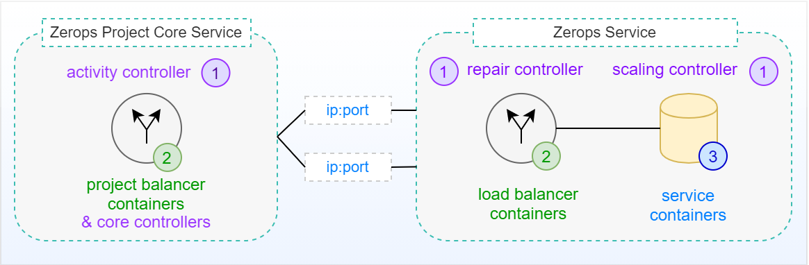

# Project & Service Structure

## Project

The Zerops project is a group of services united by a name. It can, for example, consist of a nodejs [runtime](/documentation/services/runtimes.html) with a mongo [database](/documentation/services/databases.html) and an object storage.

We [encourage](/documentation/overview/made-for-developers.html#each-developer-should-have-his-own-account-no-artificial-pricing-boosting) you to create a project for each environment, i.e. `myapp-production`, `myapp-stage`, `myapp-devel`, or even for each developer, i.e. `myapp-johnd`. You can add an unlimited number of projects, you only [pay for the usage](/documentation/overview/pricing.html) that goes over the [free basic performance](/documentation/overview/pricing.html#free-tier-unlimited-projects-and-team-members). That way, each developer can have their own copy of a project to develop on, utilizing our powerful [dev tools](/documentation/cli/vpn.html).

All services inside the project share a [private network](/documentation/routing/routing-between-project-services.html) and can see and reference [environment variables](/documentation/environment-variables/how-to-access.html) from other services.

Each project has a unique [IPv6 address](/documentation/routing/unique-ipv4-ipv6-addresses.html) assigned and optionally an [IPv4 address](/documentation/routing/unique-ipv4-ipv6-addresses.html) as well. You can then either set up public access through [domains](/documentation/routing/using-your-domain.html) and point your DNS records to the assigned IP addresses, or set up direct access to the service through the IP by [opening public ports](/documentation/routing/access-through-ip-and-firewall.html). Direct access can be managed by a built in [firewall](/documentation/routing/access-through-ip-and-firewall.html).

 

### Typical context schemas of Zerops Project Core Service

#### With no access from the external environment

It means access from outside of Zerops project infrastructure, like access from the Internet. Zerops Project Core Service is the hearth of each Zerops project. It has its own [pricing logic](/documentation/overview/pricing.html#projects). The essential parts are two running instances of the **project balancer** (one at the active state and the other at standby backup state) through which all communication is passing (either related to the project's external environment or the private network), which ensures a high degree of reliability and stability for all traffic at any time. Each of them runs in a different container located on a **different physical machine**. An independent **activity controller** continuously monitors critical operating parameters of both project balancers. If the current active instance has any abnormalities, it activates the running standby backup instead. From an external perspective, this change is not noticeable in any way.

#### With access from the external environment

## Service

Services are the most important part of Zerops. Each service consists of a cluster of Linux containers running a Zerops managed image of a technology, whether it's a [runtime](/documentation/services/runtimes.html), [database](/documentation/services/databases.html), [storage](/documentation/services/storage.html) or a [static webserver](/documentation/services/static-server.html)). Each service has a hostname and an _n_ number of [ports](/documentation/routing/routing-between-project-services.html), it can be made [public via a domain](/documentation/routing/using-your-domain.html) in case of HTTP(s) services, or via an [IP adress and a port](/documentation/routing/access-through-ip-and-firewall.html).

 

A project can contain an [unlimited number of services](/documentation/overview/made-for-developers.html#each-developer-should-have-his-own-account-no-artificial-pricing-boosting). Services are of different types and depending on their type they are either fully managed by Zerops, or partially managed by Zerops while giving you straightforward management abilities through the Zerops app.

 

 

### Runtime services
[Node.js](/documentation/services/runtimes.html#node-js), [Golang](/documentation/services/runtimes.html#golang), [PHP](/documentation/services/runtimes.html#php)

### Database services
[MariaDB (MySQL)](/documentation/services/databases.html#mariadb-mysql), [MongoDB](/documentation/services/databases.html#mongodb), [Redis](/documentation/services/databases.html#redis), [Elasticsearch](/documentation/services/databases.html#elasticsearch), 

## Message broker services 
[RabbitMQ](/documentation/services/databases.html#rabbitmq)

### Static webserver
[Nginx](/documentation/services/static-server.html)

### Storage services
[Shared storage](/documentation/services/storage.html#shared-storage), [S3 compatible Object Storage](/documentation/services/storage.html#s3-compatible-object-storage)

 

::: warning Internal services
Each project also has one or two internal services. A core service, which provides secure data communication between the Internet and your project, storage for application logs and technical statistics. And an l7 balancer, which handles HTTP(s) traffic from the Internet to your applications, HTTP(s) routing over Zerops subdomain or your own domain and SSL certificates.
:::
